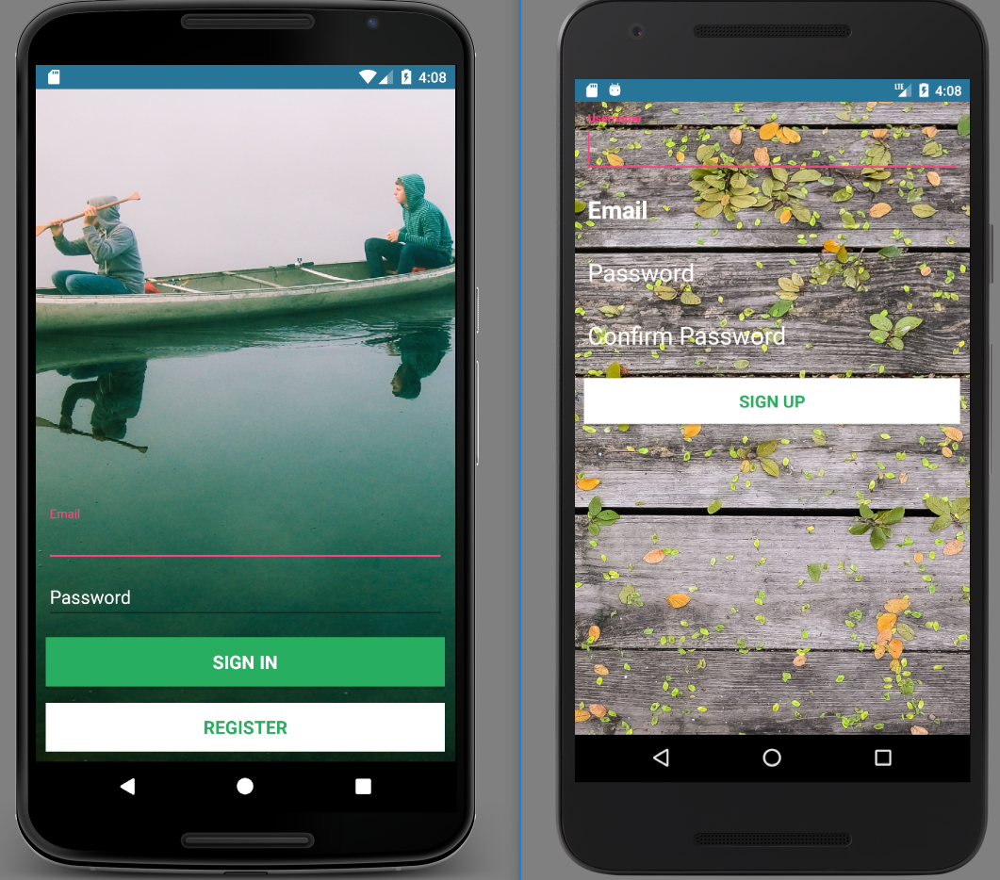
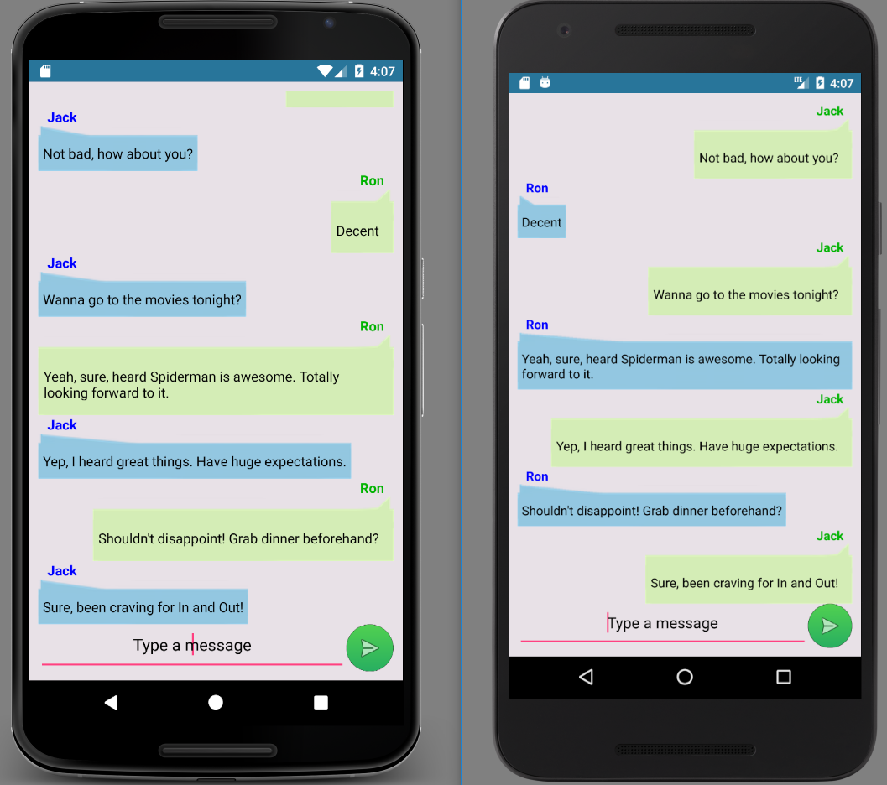

# InstantChat-Android-App
An instant messaging chat app that users across different android devices can sign into to chat.
Stores and retrieves user login authentication profiles and chat information from the real-time cloud database Firebase, hosted  by Google. 
Stores data locally on the android device using the interface SharedPreferences.
Uses the UI layout Listview (a list of scrollable items) and an Adapter object that pulls content from the cloud database Firebase and coverts the list item result into a view that’s placed into the list.

